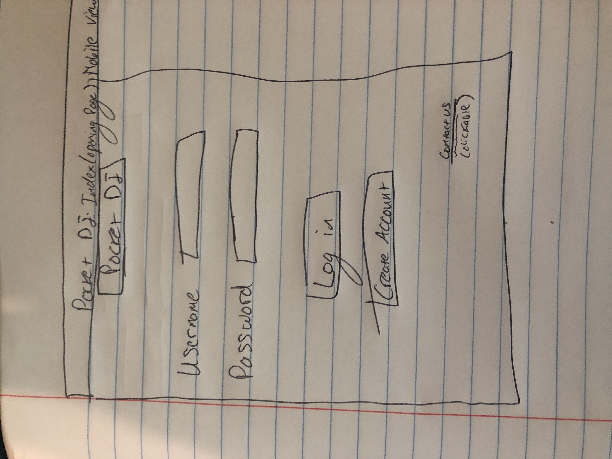
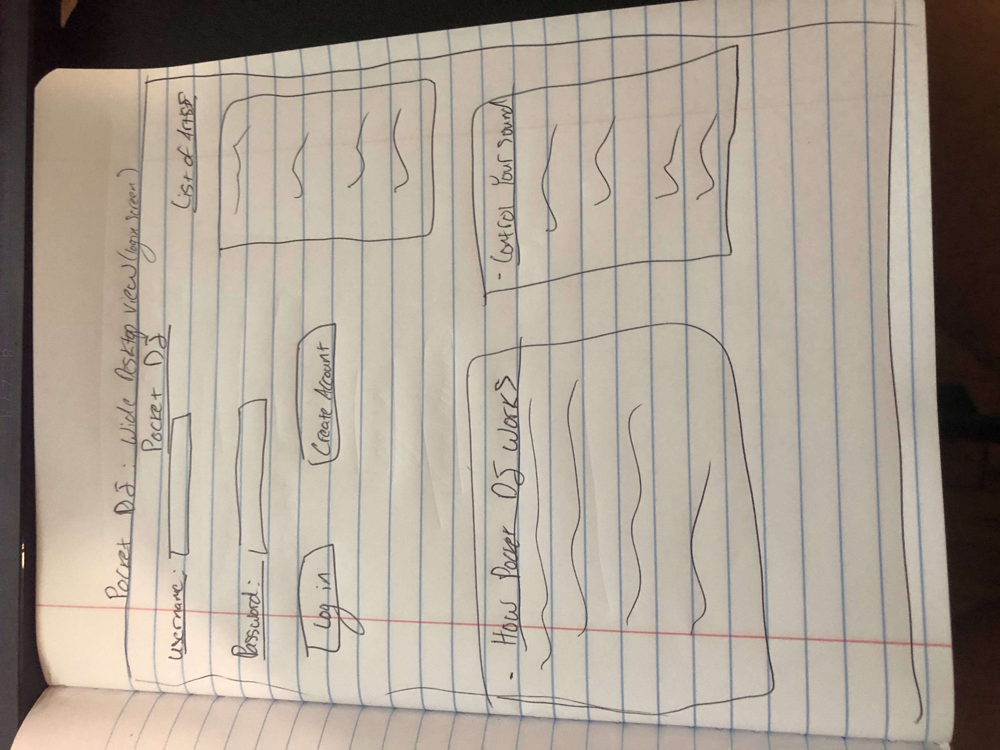
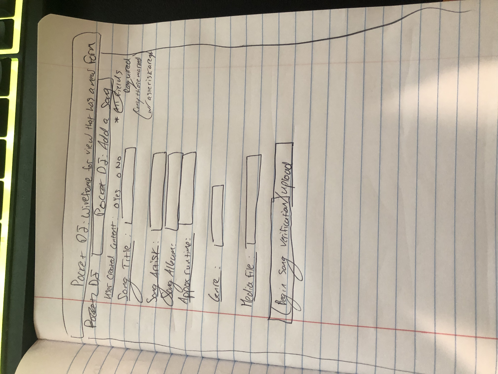

# App Planning Lab

## Getting Started

1. Fork and clone this repository.

1. Answer the questions below by editing this readme. Leave the questions and prompts, and answer in between them. Make sure when you read back your work that you've written things clearly, so that anyone reading it can easily understand what you've written.

1. Where applicable add screenshots, photos, and links.

1. You will also deploy an `index.html` page to GitHub pages.

## Instructions

You will be planning a new application to develop that will be a competitor for another popular application. Your goal is to determine the minimal functionality required so you can launch your app as soon as possible.

Choose from any popular app. It can be an app for anything:

- Music
- TV/Videos
- Shopping
- Social media
- Blog
- Forum (like Stack Overflow or Reddit)
- Chat app
- Recipes
- Business reviews

## Questions

## Project Managing Tool

#### In 1-3 sentences describe your application

> My app ...

Our app is a Music App

#### What is the name of your application?

> APP NAME : Pocket DJ

#### Create a minimum of 10 user stories. Make sure to use the format

- `As a <type of user>, I want to <some goal>, so that <some reason>.`

Write the user stories below. Add more `>` for each user story or use `-` to make a list

> As a ...
> A Pocket DJ user has to login or create an account so they can use Pocket DJ
A Pocket DJ user can listen to a song that they select so that they can enjoy it
> A Pocket DJ user can build a playlist of songs that they select so that they can have a list of songs they enjoy
> A Pocket DJ user  can like a song, so that that they are more likely to hear that song, or songs like that
> A Pocket DJ user  can search existing playlist so they can find a playlist created by another user
>A Pocket DJ user  can have a song repeat x amount of times so they can hear the song however many times they want in a row
>A Pocket DJ user  can add their own song to the database so they can contribute their own music or update the app library
>A Pocket DJ user  can play a song backwards> so they can hear what it sounds like
>A Pocket DJ user can recommend songs to other users> so they can share their sound with others
>A Pocket DJ user  can blend songs together through a mixer in the app

#### Create a new board

Follow the format provided (name of board, the 5 lists etc.) in the reading.

- Add a minimum of 5 cards (front only) based on your user stories to `Backlog`.
- Add appropriate labels.

Provide a link to your board below.

> [Pocket DJ board](https://trello.com/b/LvAi0iqf/pocket-dj-app-planning-lab)

#### For one card, fill out more details, include

- The business case
- Acceptance criteria
- Notes
- Resources

Move that card to the `Doing` list and assign yourself to it.

Provide a link to the specific card below.

> [Detailed card](https://trello.com/c/2tZLdB6F/16-a-user-can-add-their-own-song-to-the-database-so-they-can-contribute-their-own-music-or-update-the-app-library)

#### Create one bug card

Think back to a bug you had in a recent lab or project and do your best to model that example.
It can either be a bug you solved or that you didn't get a chance to solve.

It should include:

- A brief description of the bug.
- The expected behavior.
- The steps to reproduce.
- At least one resource.

Make sure to label it as a bug. Move the card to the `To Do` list.

Provide a link to the specific card below.

> [Bug card](https://trello.com/c/ceaG5Fay/12-bug-every-time-i-hit-reset-on-form-my-entire-page-does-a-reload-expected-behavior-instead-of-the-form-alone-being-reset-to-blank)

#### Create one chore card

Think back to a chore you had in a recent lab or project and model that example. Move the chore to the `Done` column.

- Assign yourself to it.
- Add a due date.

Provide a link to the specific card below.

> [Chore card](https://trello.com/c/5McsEB6j/13-chore-due-7-9-23-finish-requirements-of-this-trello-board)

### Wireframes

Create three wireframes. You may use a free online tool or draw them on paper (you can either scan them or use your phone to photograph them). You will upload them to this repository.

1. Create a wireframe for the main page that shows an index view (on mobile).

> 

1. Create a wireframe for a wide desktop view for either the index view.

> 

1. Create a wireframe for the view that has a new form (new user, new shipping information, new post, new song, new product etc.) view (on mobile).

> 

## Minimum Viable Product

Create an `index.html` file and a `styles.css` file. Using your user stories and wireframes build the responsive `index` view. You should use `lorem ipsum` placeholder text and placeholder images, where applicable. The index view should have between 2 and 5 example resources.

Deploy this to GitHub pages.

## Reflection

Write down three things that went well for you doing this lab.

- one
- two
- three

Write down one thing you'd improve on for next time.

> One thing I'd improve ...
